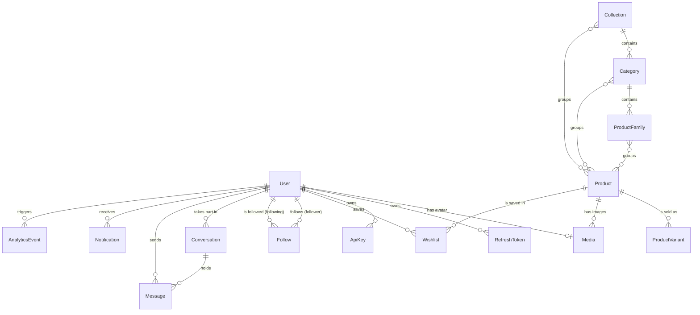

_This project has been created as part of the 42 curriculum by aben-fer, elkanega, candre--, csalaun, anmische._

# AURA

## Description

AURA is an online shop for natural skincare products. It is a full web application built for the ft_transcendence project.

The goal is to offer a calm and simple shopping experience, with a small social layer around it : users can follow each other, chat in real time and see what people add to their wishlist.

Key features :

- Product catalogue with search, filters, sorting and pagination.
- Product pages, wishlist and cart.
- Accounts with email and password, and optional two factor authentication (2FA).
- User profiles with avatar upload.
- Community space : follow other users, activity feed, real time chat and notifications.
- Admin area : manage users, roles and products, and read analytics dashboards.
- Public REST API protected by API keys, with rate limiting and documentation.
- Three languages (English, French, Arabic) with full right to left layout for Arabic.
- Secured infrastructure : HTTPS everywhere, a web application firewall and secrets stored in Vault.

## Instructions

### Prerequisites

- Git
- Docker 24+ with Docker Compose v2, or Podman 4+ with podman compose
- Make
- OpenSSL (used to generate the local HTTPS certificate)
- Latest stable Google Chrome

Node.js 20+ and npm 10+ are only needed to work on the code outside of containers.

### Configuration

1. Clone the repository in an empty folder :

   ```bash
   git clone <repository-url> aura
   cd aura
   ```

2. Create your local environment file :

   ```bash
   cp .env.example .env
   ```

   Every variable is explained inside `.env.example`. The `.env` file is ignored by Git and must never be committed.

3. Choose the demo data and the demo password. In `.env`, set :

   ```dotenv
   SEED_MODE=demo
   SEED_DEMO_PASSWORD=<a password of your choice, 8 characters minimum>
   ```

   `SEED_MODE=demo` fills the shop with products, demo users, follows and conversations. `SEED_MODE=empty` only creates the catalogue structure and the admin account.

4. Port update. In `.env`, verify :

   - If you have root privileges, and ports are frees, you can leave the example ports as they are.

   - If ports 80 and 443 are not available, you must switch to ports of your choice (for example, 8080 and 8443).
   ```dotenv
   HTTP_PORT=8080
   HTTPS_PORT=8443
   ```

5. Generate the local HTTPS certificate :

   ```bash
   bash scripts/gen-certs.sh
   ```

### Run the project

One command builds and starts everything from a clean state (Vault, database, backend, frontend, Nginx) and fills the database :

```bash
make start
```

During the start, you are asked for the **admin email and password**. Pick your own. They are kept in temporary files only while the database is filled, then deleted. They are never written to `.env`, and the password is stored in the database only as a bcrypt hash.

Then open https://localhost in Google Chrome. The certificate is self signed, so Chrome shows a warning the first time. Click "Advanced" then "Proceed".

To log in, use the admin email and password you typed during `make start`. In demo mode, demo users such as `clara@example.com` use the password set in `SEED_DEMO_PASSWORD`.

## Team Information

| Login      | Role(s)                                            |
| ---------- | -------------------------------------------------- |
| `aben-fer` | Product Owner, Project Manager, Frontend Developer |
| `elkanega` | Tech lead, Security engineer                       |
| `candre--` | Backend & devops lead                              |
| `csalaun`  | Fullstack Developer                                |
| `anmische` | Fullstack Developer                                |

## Project Management

- **Organisation :** work was split into tickets and grouped into short sprints. Each ticket had one owner.
- **Meetings :** Daily was posted to updated tickets status - A review of the project once a week.
- **Task tracking :** Linear (tickets, sprints, priorities).
- **Design :** Figma.
- **Documentation :** Notion, plus the `docs/` folder in this repository.
- **Communication :** Discord.
- **Code workflow :** one branch per ticket, created from `dev`. Every change goes through a pull request reviewed by at least one other member before it is merged. Commit messages follow the format `[type/scope] - description [AUR-xx]`, checked by Husky and Commitlint.

## Technical Stack

### Frontend

| Technology                   | Why we use it                                             |
| ---------------------------- | --------------------------------------------------------- |
| Next.js (App Router) + React | Full frontend framework with routing and server rendering |
| TypeScript                   | Type safety across the whole codebase                     |
| Tailwind CSS                 | Fast styling with a shared set of design tokens           |
| Apollo Client                | GraphQL data fetching and caching                         |
| Socket.IO client             | Real time chat and notifications                          |
| next-intl                    | Translations and language switching (EN, FR, AR)          |
| Recharts                     | Charts in the admin analytics pages                       |

### Backend

| Technology              | Why we use it                                                      |
| ----------------------- | ------------------------------------------------------------------ |
| NestJS                  | Structured Node.js framework with modules and dependency injection |
| GraphQL (Apollo Server) | One typed API for the frontend                                     |
| REST + Swagger          | Public API for external use, with generated documentation          |
| Prisma                  | Type safe ORM and database migrations                              |
| Socket.IO               | WebSocket server for real time features                            |
| class-validator         | Server side validation of every input                              |
| bcrypt                  | Password hashing with salt                                         |
| TOTP                    | Codes for two factor authentication                                |

### Database

PostgreSQL. We chose it because our data is strongly relational (users, products, follows, conversations) and because it is reliable and well supported by Prisma.

### Infrastructure and security

| Technology                | Why we use it                                                  |
| ------------------------- | -------------------------------------------------------------- |
| Docker / Podman Compose   | Run every service with one command                             |
| Nginx                     | Reverse proxy and HTTPS termination                            |
| ModSecurity (OWASP rules) | Web application firewall in front of the app                   |
| HashiCorp Vault           | Stores secrets (JWT keys, TOTP secrets) encrypted and isolated |

### Developer tooling

ESLint, Prettier, Husky and Commitlint keep the code and the commit history consistent.

## Database Schema

PostgreSQL, managed with Prisma. The full schema is in `backend/prisma/schema.prisma` and every change is a versioned migration in `backend/prisma/migrations/`.



All ids are UUIDs. Every table has a `createdAt` date, most also have `updatedAt`.

| Table          | Key fields (type)                                                                                                                                                                                                                                   | Relations                                                                                         |
| -------------- | --------------------------------------------------------------------------------------------------------------------------------------------------------------------------------------------------------------------------------------------------- | ------------------------------------------------------------------------------------------------- |
| User           | name (varchar 100), email (varchar 320, unique), handle (varchar 30, unique), bio (varchar 500), passwordHash (varchar 255), role (USER or ADMIN), status (ACTIVE, SUSPENDED or DELETED), twoFactorEnabled (boolean), deletedAt (date, soft delete) | one avatar, many tokens, keys, wishlist items, follows, conversations, messages and notifications |
| RefreshToken   | tokenHash (SHA-256, unique), familyId (uuid), isRevoked (boolean), revocationReason (enum), expiresAt (date)                                                                                                                                        | belongs to one user                                                                               |
| ApiKey         | name (varchar 100), keyHash (SHA-256, unique), scopes (text list), isRevoked (boolean), expiresAt and lastUsedAt (date)                                                                                                                             | belongs to one user                                                                               |
| Media          | url (text), altText (varchar 255), mimeType (varchar 100), position (int)                                                                                                                                                                           | avatar of one user, or image of one product                                                       |
| Collection     | name, slug (unique), description, isActive (boolean), heroImageUrl                                                                                                                                                                                  | many categories, many products                                                                    |
| Category       | name, slug (unique), description, isActive (boolean)                                                                                                                                                                                                | belongs to one collection, many product families, many products                                   |
| ProductFamily  | name, slug (unique), description, isActive (boolean)                                                                                                                                                                                                | belongs to one category, many products                                                            |
| Product        | name (varchar 160), slug (unique), description (text), isActive (boolean), badges (text list), popularityScore (float)                                                                                                                              | many variants, images, collections, categories and families                                       |
| ProductVariant | label (varchar 50, unique per product), price (decimal 10,2), isAvailable (boolean), isOnSale (boolean), discountPercentage (decimal 5,2)                                                                                                           | belongs to one product                                                                            |
| Wishlist       | userId, productId (unique pair)                                                                                                                                                                                                                     | links one user to one product                                                                     |
| Follow         | followerId, followingId (composite primary key)                                                                                                                                                                                                     | links two users                                                                                   |
| Conversation   | userOneId, userTwoId (unique pair), initiatorId, status (PENDING, ACCEPTED or DECLINED)                                                                                                                                                             | links two users, holds many messages                                                              |
| Message        | content (text), senderId (kept empty if the sender is deleted)                                                                                                                                                                                      | belongs to one conversation and one sender                                                        |
| Notification   | type (FOLLOW, MESSAGE, WISHLIST or SYSTEM), title (varchar 160), body (varchar 500), readAt (date)                                                                                                                                                  | belongs to one user, may point to the user who caused it                                          |
| AnalyticsEvent | eventType (varchar 100), targetType, targetId, occurredAt (date)                                                                                                                                                                                    | belongs to the user who caused it                                                                 |

## Features List

| Feature                   | Description                                                                | Team member(s)               |
| ------------------------- | -------------------------------------------------------------------------- | ---------------------------- |
| Catalogue                 | Browse products with search, filters, sorting and pagination               | csalaun, candre--, aben-fer  |
| Product page              | Details, sizes, price and add to cart                                      | csalaun, candre--, aben-fer  |
| Wishlist                  | Save and remove favourite products                                         | csalaun, candre--, aben-fer  |
| Cart and checkout         | Cart, shipping form with validation, order summary (payment not connected) | csalaun, candre--, aben-fer  |
| Sign up and login         | Email and password, hashed passwords, refresh tokens                       | elkanega, candre--, aben-fer |
| Two factor authentication | Enable, verify and disable 2FA with an authenticator app                   | elkanega                     |
| Profile and settings      | Edit profile, change email and password, upload an avatar                  | csalaun, candre--, aben-fer  |
| Community                 | Follow users, activity feed, people directory                              | csalaun, anmische            |
| Chat                      | Real time private messages with conversation requests                      | csalaun, anmische            |
| Notifications             | Real time notifications for messages, requests and follows                 | csalaun, anmische            |
| Admin                     | Manage users, roles and products                                           | csalaun, candre--, aben-fer  |
| Analytics                 | Dashboards for users, products and wishlist activity                       | csalaun, candre--            |
| Public API                | REST endpoints with API keys, rate limiting and Swagger docs               | candre--                     |
| Languages                 | English, French and Arabic with right to left layout                       | aben-fer                     |
| Legal pages               | Privacy Policy, Terms of Service and Terms of Sale                         | elkanega                     |
| Security                  | HTTPS, ModSecurity firewall, Vault for secrets                             | elkanega                     |

## Modules

| #   | Module                                                | Type  | Points | Team member(s)               |
| --- | ----------------------------------------------------- | ----- | ------ | ---------------------------- |
| 1   | Web : framework for frontend and backend              | Major | 2      | aben-fer, candre--, elkanega |
| 2   | Web : real time features with WebSockets              | Major | 2      | anmische                     |
| 3   | Web : users interact with other users                 | Major | 2      | anmische, csalaun            |
| 4   | Web : public API                                      | Major | 2      | candre--                     |
| 5   | User Management : standard user management            | Major | 2      | csalaun                      |
| 6   | User Management : advanced permissions                | Major | 2      | candre--, csalaun            |
| 7   | Cybersecurity : WAF / ModSecurity and HashiCorp Vault | Major | 2      | elkanega                     |
| 8   | Web : ORM                                             | Minor | 1      | elkanega, candre--           |
| 9   | Web : advanced search                                 | Minor | 1      | csalaun, candre--            |
| 10  | Web : custom design system                            | Minor | 1      | aben-fer                     |
| 11  | Accessibility : multiple languages                    | Minor | 1      | aben-fer                     |
| 12  | Accessibility : right to left languages               | Minor | 1      | aben-fer                     |
| 13  | User Management : 2FA                                 | Minor | 1      | elkanega                     |
| 14  | User Management : user activity analytics             | Minor | 1      | csalaun                      |

**Total : 7 Major × 2 + 7 Minor × 1 = 21 points** (14 required, the extra points count as bonus).

### Justification and implementation

**1. Framework for frontend and backend (Major).** Next.js on the frontend and NestJS on the backend. Both give us a clear structure, strong TypeScript support and a large ecosystem.

**2. Real time features (Major).** A Socket.IO gateway in NestJS. Each user joins a private room after the server checks their token. Messages, conversation requests, notifications and feed activity are pushed live to the right users. The client reconnects on its own after a network loss.

**3. Users interact with other users (Major).** Private chat between users, public profile pages, and a friends system based on follows : a user can follow and unfollow others and see the list of people they follow.

**4. Public API (Major).** REST endpoints under `/api/v1`, documented with Swagger. Each call needs a personal API key, created from the account settings. Calls are rate limited per key. Endpoints include `GET` products, collections and categories, `POST` and `DELETE` wishlist items and `PUT` profile.

**5. Standard user management (Major).** Users edit their profile, upload an avatar (initials are shown when there is none), follow other users and see who is online, and have a public profile page.

**6. Advanced permissions (Major).** Roles (user, admin). Admins can view, edit, suspend and delete users and change their role. The interface and the available actions change with the role, and the backend checks the role on every protected request.

**7. WAF and Vault (Major).** Nginx runs ModSecurity with the OWASP Core Rule Set in blocking mode. False positives are handled with narrow exclusions in `nginx/modsecurity/exclusions.conf` (for example GraphQL query text, or build file names like `1--e.css` that look like an SQL comment), never by turning a rule off for the whole site. Secrets (JWT keys, per user TOTP secrets) live in HashiCorp Vault. The backend reads them at runtime with its own limited policy.

**8. ORM (Minor).** Prisma for the schema, typed queries and versioned migrations.

**9. Advanced search (Minor).** The catalogue combines text search, filters (collection, category, product family, price), sorting and pagination, all resolved on the server.

**10. Custom design system (Minor).** A shared set of colour, typography and spacing tokens, and more than 10 reusable components (button, input, select, dialog, avatar, badge, tabs, toast, skeleton…). See `docs/design_system.md`.

**11. Multiple languages (Minor).** English, French and Arabic with next-intl. All user facing text comes from translation files, and a language switcher is always visible in the navbar.

**12. Right to left languages (Minor).** Arabic switches the whole layout to right to left. We use logical CSS properties so margins, borders and icons are mirrored, not only the text.

**13. Two factor authentication (Minor).** TOTP with any authenticator app. Setup with a QR code, a code is asked at every login, and 2FA can be turned off after confirming a valid code.

**14. User activity analytics (Minor).** Admin dashboards with charts about users, products and wishlist activity, with a period selector.

## Individual Contributions

### aben-fer (Product Owner, Project Manager, Frontend Developer)

- **Features and modules :** product vision and priorities, Linear tickets and sprint follow up, pull request reviews. Custom design system (module 10), full translation of the site in English, French and Arabic (module 11) and right to left layout (module 12). Frontend work on the catalogue, product pages, wishlist, cart and checkout, admin sidebar, footer, About page and Service status page. Final project audit against the subject and the evaluation sheet, Makefile rework and this README.
- **Challenges :** translating every screen without breaking the layout, and making Arabic truly right to left (logical CSS properties, mirrored icons, left to right emails and numbers inside right to left forms). During the audit, finding and fixing issues found late : unused services (Redis, OAuth, SMTP) removed from the stack, and a ModSecurity false positive that blocked our CSS because a build file name looked like an SQL comment.

### elkanega (Tech Lead, Security Engineer)

- **Features and modules :** technical architecture and review of critical changes. Sign up and login with hashed passwords and refresh tokens, two factor authentication (module 13), WAF with ModSecurity and HashiCorp Vault (module 7), ORM setup with Prisma (module 8, with candre--). Legal pages (Privacy Policy, Terms of Service, Terms of Sale).
- **Challenges :** keeping secrets out of the code and of the containers : JWT keys and per user TOTP secrets are read from Vault at runtime, with a limited policy for the backend. Tuning ModSecurity so it blocks real attacks without blocking normal GraphQL traffic.

### candre-- (Backend and DevOps Lead)

- **Features and modules :** backend structure with NestJS (module 1, with aben-fer and elkanega), public REST API with API keys, rate limiting and Swagger docs (module 4), advanced permissions with roles (module 6, with csalaun), ORM and migrations (module 8, with elkanega), server side search and filters for the catalogue (module 9, with csalaun). Backend for products, wishlist, profiles, admin and analytics. Docker stack and database seed.
- **Challenges :** designing an API that stays safe when opened to the outside (hashed API keys, one active key per user, rate limits per key), and a one command setup that starts Vault, the database and every service in the right order.

### csalaun (Fullstack Developer)

- **Features and modules :** standard user management (module 5) : profile editing, avatar upload, public profile pages. Advanced search in the catalogue (module 9, with candre--), advanced permissions on the admin side (module 6, with candre--), user activity analytics dashboards (module 14). Catalogue, product page, wishlist, admin users and products pages, and part of the community space (module 3, with anmische).
- **Challenges :** building admin screens where actions change with the user role, and analytics charts that stay fast on real data with a period selector.

### anmische (Fullstack Developer)

- **Features and modules :** real time features with Socket.IO (module 2) : authenticated WebSocket connection, private rooms per user and per conversation. Chat with conversation requests, real time notifications and activity feed (module 3, with csalaun).
- **Challenges :** keeping real time data consistent between several open sessions (messages, notifications and feed updates reach the right users only), and handling disconnections and reconnections cleanly.

## Resources

- [Next.js documentation](https://nextjs.org/docs)
- [NestJS documentation](https://docs.nestjs.com)
- [Prisma documentation](https://www.prisma.io/docs)
- [Apollo GraphQL documentation](https://www.apollographql.com/docs)
- [Socket.IO documentation](https://socket.io/docs/v4)
- [next-intl documentation](https://next-intl.dev/docs)
- [Tailwind CSS documentation](https://tailwindcss.com/docs)
- [HashiCorp Vault documentation](https://developer.hashicorp.com/vault/docs)
- [OWASP ModSecurity Core Rule Set](https://coreruleset.org/docs)
- [RFC 6238 : TOTP algorithm](https://datatracker.ietf.org/doc/html/rfc6238)
- [WCAG 2.1 quick reference](https://www.w3.org/WAI/WCAG21/quickref)

More project notes are in the `docs/` folder : setup, conventions and architecture decisions.

### How AI was used

We used AI as a support tool.

- **Code review :** a second look at pull requests to spot bugs and security issues.
- **Translations :** Help on the Arabic texts, spell check french and english copy. Final wording and copy by the team.
- **Documentation :** help to structure our documentation.
- **Tooling :** help to understand debug and devops phases.
